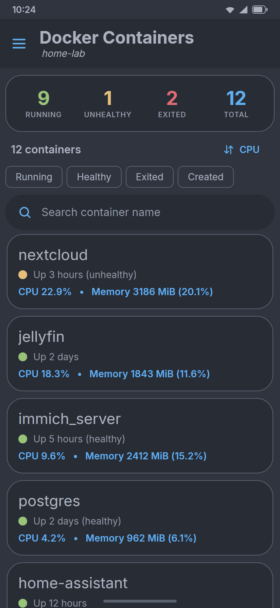
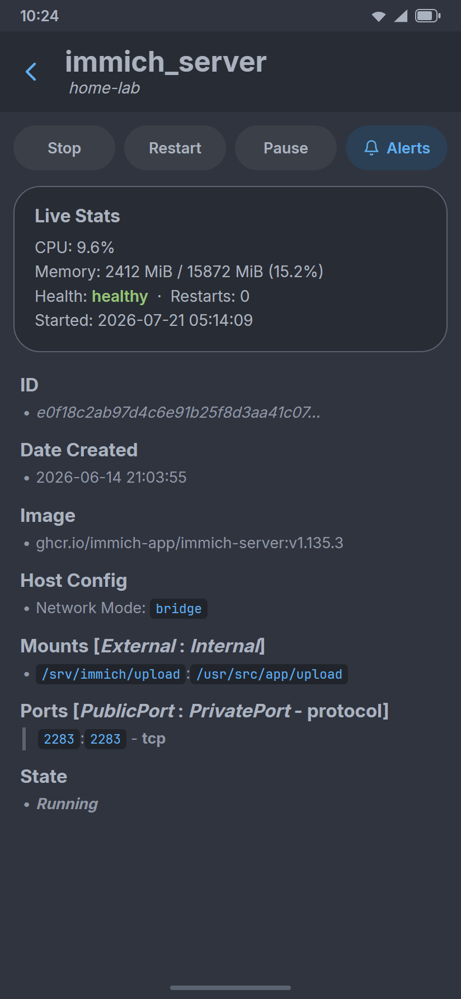
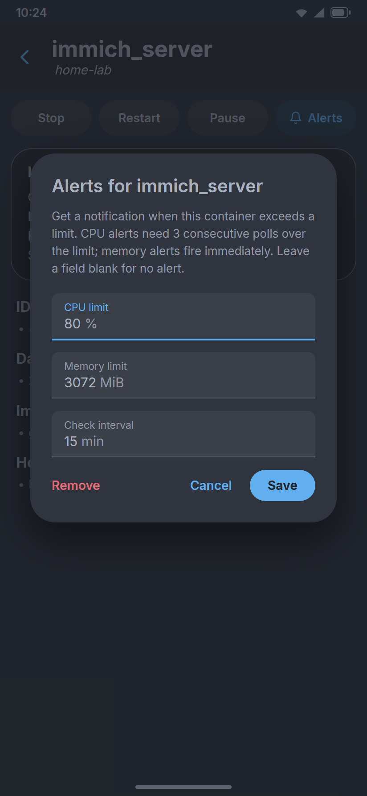
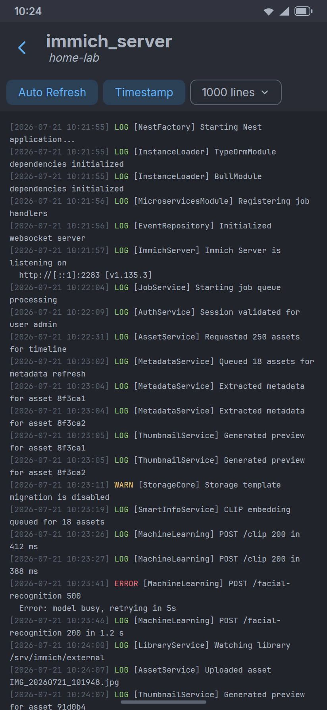

# AndroTainer

Android companion app for [Portainer](https://www.portainer.io/) — manage your containers from your phone.

## About this fork

This repository is a fork of [althafvly/AndroTainer](https://github.com/althafvly/AndroTainer), another fork of the original [dokeraj/AndroTainer](https://github.com/dokeraj/AndroTainer). All credit for the core app — login (username/password or API key), multi-server/multi-user support, container start/stop/restart/delete, details, and log viewing — goes to those upstream projects.

### What this fork adds

Adds visibility and alerting for CPU and memory utilization, modernizes some of the UI, fixes API key login issues, and that's about it.

- **Live CPU & memory visibility** — each container card shows current CPU % and memory usage (MiB and % of limit), fetched from the Docker stats API. The details page adds health status, restart count, uptime, exit code, and OOM-killed info from container inspect.
- **Sorting & filtering** — sort the container list by name, uptime, creation date, CPU, or memory usage, and narrow it with multi-select state filters (running / healthy / exited / created) alongside live name search. Sort preferences are persisted.
- **Threshold notifications** — set per-container CPU and memory thresholds in the app; a periodic background worker (WorkManager) polls stats and posts a local notification when a threshold is exceeded or a container turns unhealthy, with cooldowns to avoid notification spam.
- **Modernized UI** — migrated the theme to Material 3 (Expressive), refreshed the color system, and updated components (chips, cards, typography) accordingly.
- **Tests & CI** — unit tests for the new stats, sorting, and threshold logic, plus GitHub Actions workflows for debug builds and manually-triggered signed release APKs.

## Screenshots

| Container list | Details & live stats | Threshold alerts | Log viewer |
|:---:|:---:|:---:|:---:|
|  |  |  |  |

*UI previews rendered with mock data.*

## Install

Grab the latest APK from the [Releases page](https://github.com/steven-ahfu/AndroTainer/releases), or add this repo to [Obtainium](https://github.com/ImranR98/Obtainium) to get updates automatically:

<a href="obtainium://add/https://github.com/steven-ahfu/AndroTainer"></a>

(Or in Obtainium: Add App → paste `https://github.com/steven-ahfu/AndroTainer`.)

## Building

Requires JDK 21 and Android SDK 36.

```bash
./gradlew assembleDebug   # → app/build/outputs/apk/debug/app-debug.apk
```

Release builds are signed only when the `ANDROID_KEYSTORE_*` environment variables are set; otherwise they build unsigned.

## Credits

- [dokeraj/AndroTainer](https://github.com/dokeraj/AndroTainer) — the original AndroTainer app.
- [althafvly/AndroTainer](https://github.com/althafvly/AndroTainer) — extensive modernization: Kotlin DSL + version catalog, Gradle/AGP/Kotlin upgrades, ViewBinding, KSP, Coil, translations, RTL and accessibility fixes, and lint cleanup.

---------------------------------------------

## License

This fork is distributed under the **GNU General Public License, version 3 only** (`GPL-3.0-only`). See [LICENSE](LICENSE) for the full license text.

Code inherited from [althafvly/AndroTainer](https://github.com/althafvly/AndroTainer) and [dokeraj/AndroTainer](https://github.com/dokeraj/AndroTainer) was received under the Unlicense/public-domain dedication described by those upstream projects. That original grant remains available for the inherited upstream material. Copyrightable changes made in this repository are licensed under GPLv3, and this combined fork is distributed under GPLv3. See [LICENSE-NOTICE.md](LICENSE-NOTICE.md) for details.
